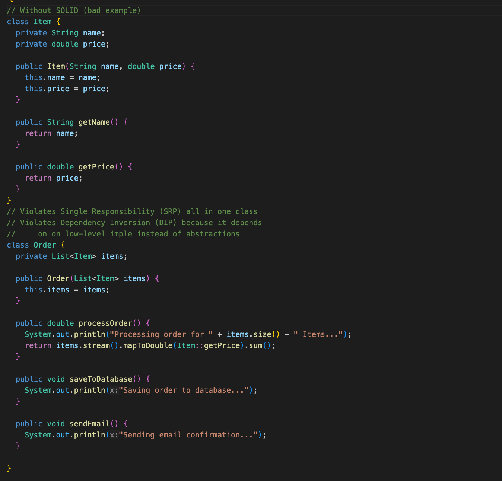
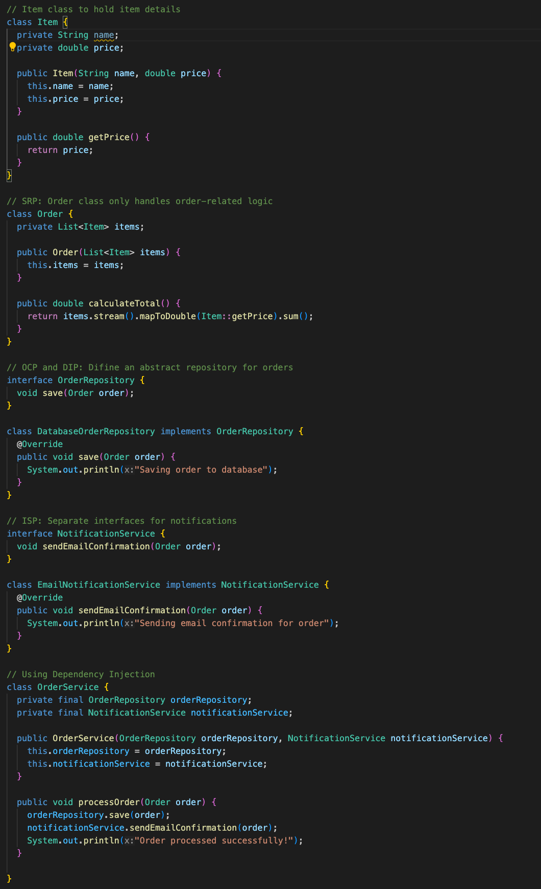

# Introduction

This week, in my free time, I watched a gay on Youtube talking about how the SOLID principles are very interested, so I decided to read about theory and see how they are applied in practive. 

As incredible as it may seem, I've been applying this patters in my code for a long time, since got my degree at FACCAT, in 2014. I was using them, but I didn't know the actual names of each one.

So let`s take a look ate each pattern and apply them in a simple code example.

## SOLID Principle:

1. **Single Responsibility Principle (SRP):** A class should have only one reason to change, meaning it should only have one responsibility.
2. **Open/Closed Principle (OCP):** Software entities (classes, modules, functions) should be open for extension but closed for modification.
3. **Liskov Substitution Principle (LSP):** Subtypes must be substitutable for their base types without affecting program correctness.
4. **Interface Segregation Principle (ISP):** Clients should not be forced to depend on interfaces they do not use.
5. **Dependency Inversion Principle (DIP):** High-level modules should not depend on low-level modules; both should depend on abstractions.

## ❌ Without SOLID (Bad Design)



## ✅ With SOLID (Better Design)




## How SOLID was applied:

- SRP: **Order** only handles order-related logic.
- OCP: We can add new **OrderRepository** implementations without modifying existing code.
- LSP: **DatabaseOrderRepository** and **EmailNotificationService** can be replaced with other implementations (e.g., **FileOrderRepository**).
- ISP: **OrderRepository** and **NotificationService** are separate interfaces.
- DIP: **OrderService** depends on abstractions (**OrderRepository, NotificationService**) instead of concrete implementations.


## Benefits:
- ✅ More modular and maintainable;
- ✅ Easy to extend without modifying existing code;
- ✅ Easy to test with mock implementations.

## Tests with JUnit 

Here are JUnit 5 test cases for the SOLID Order Processing System implementation

If you are using Maven, add this dependency to pom.xml
````
<dependencies>
    <dependency>
        <groupId>org.junit.jupiter</groupId>
        <artifactId>junit-jupiter-api</artifactId>
        <version>5.9.2</version>
        <scope>test</scope>
    </dependency>
    <dependency>
        <groupId>org.mockito</groupId>
        <artifactId>mockito-core</artifactId>
        <version>4.8.0</version>
        <scope>test</scope>
    </dependency>
</dependencies>
````

## Unit Tests for Order Processing System

We will user Mockito to mock dependencies like **OrderRepository** and **NotificationService**


## Explanatio of the Tests

- **OrderTest**
    - **testCalculateTotal()**: VErifies that the total price calculation works correctly.
- **OrderServiceTest**
    - **setUp()**: Users Mockito to create mock objects before each  test.
    - **testProcessOrder_CallsSaveAndSendMethods()**:
        - Ensures **save()** is called once when processing an order.
        - Ensures **send()** is called once when an order is processd.

## Running the Tests
Using Maven, run:
````
mvn test
````
